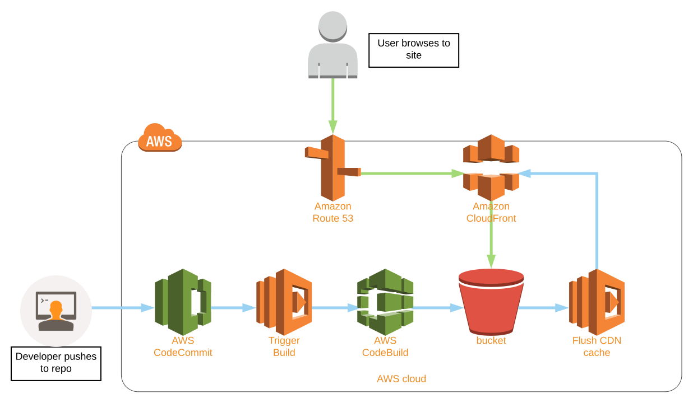

# Table of contents
- [Table of contents](#table-of-contents)
- [Introduction](#introduction)
- [Workflow](#workflow)
- [Pre-requisites](#pre-requisites)
- [Software requirements](#software-requirements)
- [Build steps:](#build-steps)
# Introduction
Continuous deployment workflow for static websites on S3.This script builds resources in AWS using the [Python SDK](https://aws.amazon.com/sdk-for-python/) enabling a simplfied workflow for creating content with static website generators such as [Jekyll](https://jekyllrb.com), [Hugo](https://gohugo.io) or [Pelican](https://getpelican.com/) .

# Workflow
Once complete the final workflow will look like this:



This script will create the following resources in your AWS account:

- CodeCommit repo to store source code .
- CodeBuild job to generate new content when source code is updated .
- S3 Bucket to host content .
- CloudFront CDN .
- SSL Certificate for your website .
- Lambda functions to automatically trigger steps within workflow .
- IAM roles to control access and authorisation .

# Pre-requisites
There are a few things that need to be in place prior to running this script in order for it to execute successfully .

1. If you don't already own one you will need to register a domain name from a provider such as GoDaddy, Verisign etc. AWS themselves also offer this [service](https://docs.aws.amazon.com/Route53/latest/DeveloperGuide/registrar.html) and if you use them they will take care of managing DNS on your behalf .
2.  An AWS account .
3.  Some familiarity with the command line .
4.  Make Amazon Route53 the [authorative DNS servers](https://docs.aws.amazon.com/Route53/latest/DeveloperGuide/MigratingDNS.html) for the registered domain created in step 1 .
5. An AWS Access Key ID and Secret Access Key. If you already have the [AWS CLI](https://docs.aws.amazon.com/cli/latest/userguide/cli-chap-configure.html) installed the simplest way to check this is to type `aws configure` at a terminal prompt .

# Software requirements
   - Python3, the most straight-forward way to install on a Mac is via [homebrew](https://brew.sh). Simply type `brew install python` in your terminal .
   - Git, again at least in terms of a mac brew is your friend, just type: `brew install git` .
   - A code editor. I use [Visual Studio Code](https://code.visualstudio.com) .
   - *Optional* - [virtualenvwrapper](https://pypi.org/project/virtualenvwrapper/) .


# Build steps:
Once all the pre-requisites are satisfied we can begin building out the foundations for our workflow . If you haven't already done so open up your terminal and enter the following commands .
```bash
git clone https://github.com/jeff-tooke/s3-website-cd-pipeline.git
````
````bash
cd aws-s3-continuous-deployment
````
````bash
pip install -r requirements.txt
````
Next you will need to enter some variables that will be used within the script so go ahead and open the settings<span><span>.py file in your editor.
````python
region = 'us-east-1'                 
proj_name= 'personal-blog'                
proj_desc= 'My personal blog website'          
dns_domain= 'example.com'              
website_fqdn= 'example.com'
````
In the above example resources are created in the *US-EAST-1* region and the website would be addressable over the internet by simply typing *__example<span><span>.com__* into a browser. If I wanted the website to be accessible on say *__www<span><span>.example.com__* I would simply add the *www* prefix to the *__website_fqdn__* variable in the settings file.

Once you are happy with the settings save the file and run the setup<span><span>.py script . 

__Note:__ It can take up to an hour for the script to complete because it takes some time for a Cloudfront CDN to be provisioned and I have incorporated a handler within the code that waits for a signal that cdn is ready before proceeding. This step can be safely skipped if you prefer not to wait by commenting out the section:
````python
#################################################
## Wait for CDN to be deployed
#################################################
print('''NOTE: It takes on average 30 to 40 minutes for
cloudfront distribution setup to complete, I suggest 
grabbing a tasty beverage at this point, the script will
automatically proceed once the cdn is ready.''')
waiter = cdn.get_waiter('distribution_deployed')
waiter.wait(
    Id= cdn_dist_id,
    WaiterConfig={
        'Delay': 60,
        'MaxAttempts': 60
    }
)
print()
print('cdn successfully deployed...')
print()
````


[Back to top](#table-of-contents)
-


